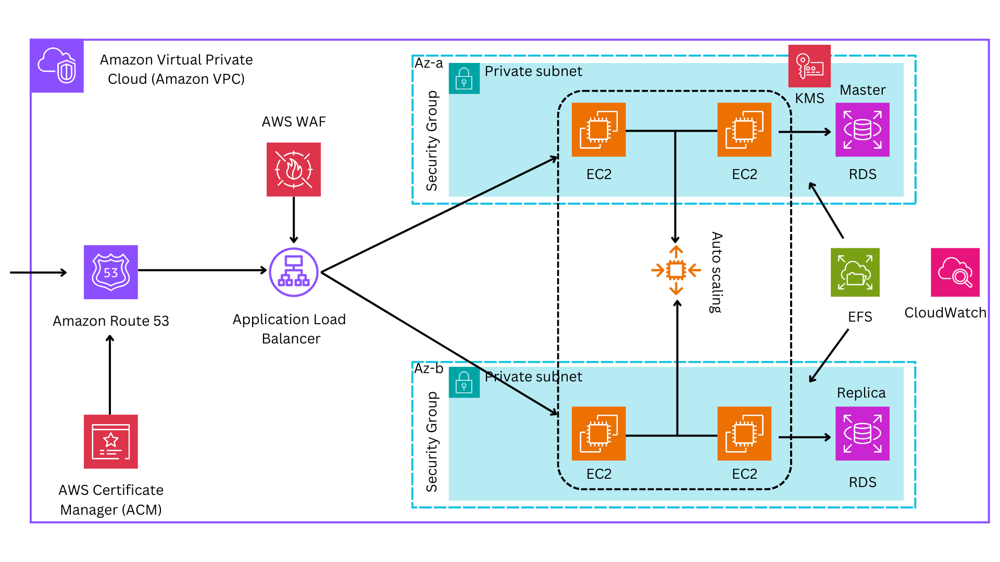

# AWS-Architecture-Using-Terraform

==============================

## Overview of the Architecture 

Our target architecture, designed for high availability, comprises various AWS services, each with a specific role in the stack:

1. DNS Configuration with AWS Route 53:
Begin with setting up your DNS using AWS Route 53. It will direct traffic to your application, ensuring that the domain name is resolved to the right resources.

2. Load Balancing with High Availability:
Implement the AWS ALB for distributing the traffic evenly across your EC2 instances. The ALB also checks the health of the instances and only routes traffic to the healthy ones.

3. Securing the Transmission:
Utilize AWS Certificate Manager to handle the SSL/TLS certificates. This is crucial for encrypting data in transit and providing a secure channel for your users.

4. Protecting Your Application:
Configure AWS WAF to protect your application from common web exploits that could affect availability, compromise security, or consume excessive resources.

5. Elasticity with Auto Scaling:
Use Auto Scaling to maintain application availability and allow the number of Amazon EC2 instances to scale up or down automatically according to conditions you define.

6. Persistent Storage Across Instances:
Employ Amazon EFS, which provides a simple interface that allows your application to access shared file storage.

7. Database with High Availability:
Set up Amazon RDS with a master and a replica in different Availability Zones to ensure that your database is highly available and resilient to infrastructure failures.

8. Monitoring and Alerting:
With AWS CloudWatch, keep an eye on your application's performance and set up alerts for any anomalies that might indicate issues with availability.

10. Infrastructure as Code with Terraform
Finally, use Terraform to script the creation of all these services in AWS. Terraform will allow you to deploy this entire architecture in a repeatable and predictable manner.

## Resources

| Name | Type |
|------|------|
| [aws_acm_certificate.example_cert](https://registry.terraform.io/providers/hashicorp/aws/latest/docs/resources/acm_certificate) | resource |
| [aws_acm_certificate_validation.example_cert](https://registry.terraform.io/providers/hashicorp/aws/latest/docs/resources/acm_certificate_validation) | resource |
| [aws_autoscaling_group.app_asg](https://registry.terraform.io/providers/hashicorp/aws/latest/docs/resources/autoscaling_group) | resource |
| [aws_autoscaling_policy.web_policy_down](https://registry.terraform.io/providers/hashicorp/aws/latest/docs/resources/autoscaling_policy) | resource |
| [aws_autoscaling_policy.web_policy_up](https://registry.terraform.io/providers/hashicorp/aws/latest/docs/resources/autoscaling_policy) | resource |
| [aws_cloudwatch_metric_alarm.web_cpu_alarm_down](https://registry.terraform.io/providers/hashicorp/aws/latest/docs/resources/cloudwatch_metric_alarm) | resource |
| [aws_cloudwatch_metric_alarm.web_cpu_alarm_up](https://registry.terraform.io/providers/hashicorp/aws/latest/docs/resources/cloudwatch_metric_alarm) | resource |
| [aws_db_instance.db](https://registry.terraform.io/providers/hashicorp/aws/latest/docs/resources/db_instance) | resource |
| [aws_db_subnet_group.rds_subnet_group](https://registry.terraform.io/providers/hashicorp/aws/latest/docs/resources/db_subnet_group) | resource |
| [aws_efs_file_system.app_efs](https://registry.terraform.io/providers/hashicorp/aws/latest/docs/resources/efs_file_system) | resource |
| [aws_efs_mount_target.efs_mt](https://registry.terraform.io/providers/hashicorp/aws/latest/docs/resources/efs_mount_target) | resource |
| [aws_eip.nat](https://registry.terraform.io/providers/hashicorp/aws/latest/docs/resources/eip) | resource |
| [aws_iam_instance_profile.ssm_instance_profile](https://registry.terraform.io/providers/hashicorp/aws/latest/docs/resources/iam_instance_profile) | resource |
| [aws_iam_role.ssm_role](https://registry.terraform.io/providers/hashicorp/aws/latest/docs/resources/iam_role) | resource |
| [aws_iam_role_policy_attachment.ssm_policies](https://registry.terraform.io/providers/hashicorp/aws/latest/docs/resources/iam_role_policy_attachment) | resource |
| [aws_internet_gateway.gw](https://registry.terraform.io/providers/hashicorp/aws/latest/docs/resources/internet_gateway) | resource |
| [aws_launch_template.app](https://registry.terraform.io/providers/hashicorp/aws/latest/docs/resources/launch_template) | resource |
| [aws_lb.app_alb](https://registry.terraform.io/providers/hashicorp/aws/latest/docs/resources/lb) | resource |
| [aws_lb_listener.front_end](https://registry.terraform.io/providers/hashicorp/aws/latest/docs/resources/lb_listener) | resource |
| [aws_lb_listener.https](https://registry.terraform.io/providers/hashicorp/aws/latest/docs/resources/lb_listener) | resource |
| [aws_lb_target_group.app_tg](https://registry.terraform.io/providers/hashicorp/aws/latest/docs/resources/lb_target_group) | resource |
| [aws_nat_gateway.nat](https://registry.terraform.io/providers/hashicorp/aws/latest/docs/resources/nat_gateway) | resource |
| [aws_route53_record.cert_validation](https://registry.terraform.io/providers/hashicorp/aws/latest/docs/resources/route53_record) | resource |
| [aws_route53_record.www](https://registry.terraform.io/providers/hashicorp/aws/latest/docs/resources/route53_record) | resource |
| [aws_route53_zone.main](https://registry.terraform.io/providers/hashicorp/aws/latest/docs/resources/route53_zone) | resource |
| [aws_route_table.private](https://registry.terraform.io/providers/hashicorp/aws/latest/docs/resources/route_table) | resource |
| [aws_route_table.public](https://registry.terraform.io/providers/hashicorp/aws/latest/docs/resources/route_table) | resource |
| [aws_route_table_association.private](https://registry.terraform.io/providers/hashicorp/aws/latest/docs/resources/route_table_association) | resource |
| [aws_route_table_association.public](https://registry.terraform.io/providers/hashicorp/aws/latest/docs/resources/route_table_association) | resource |
| [aws_security_group.alb_sg](https://registry.terraform.io/providers/hashicorp/aws/latest/docs/resources/security_group) | resource |
| [aws_security_group.ec2_sg](https://registry.terraform.io/providers/hashicorp/aws/latest/docs/resources/security_group) | resource |
| [aws_security_group.efs_sg](https://registry.terraform.io/providers/hashicorp/aws/latest/docs/resources/security_group) | resource |
| [aws_security_group.rds_sg](https://registry.terraform.io/providers/hashicorp/aws/latest/docs/resources/security_group) | resource |
| [aws_ssm_parameter.db_password](https://registry.terraform.io/providers/hashicorp/aws/latest/docs/resources/ssm_parameter) | resource |
| [aws_subnet.private](https://registry.terraform.io/providers/hashicorp/aws/latest/docs/resources/subnet) | resource |
| [aws_subnet.public](https://registry.terraform.io/providers/hashicorp/aws/latest/docs/resources/subnet) | resource |
| [aws_vpc.main](https://registry.terraform.io/providers/hashicorp/aws/latest/docs/resources/vpc) | resource |
| [aws_wafv2_ip_set.block_ip_set](https://registry.terraform.io/providers/hashicorp/aws/latest/docs/resources/wafv2_ip_set) | resource |
| [aws_wafv2_web_acl.main_acl](https://registry.terraform.io/providers/hashicorp/aws/latest/docs/resources/wafv2_web_acl) | resource |
| [aws_wafv2_web_acl_association.alb_assoc](https://registry.terraform.io/providers/hashicorp/aws/latest/docs/resources/wafv2_web_acl_association) | resource |
| [random_password.root_password](https://registry.terraform.io/providers/hashicorp/random/latest/docs/resources/password) | resource |
| [aws_kms_key.db_kms_key](https://registry.terraform.io/providers/hashicorp/aws/latest/docs/data-sources/kms_key) | data source |
| [aws_route53_zone.main](https://registry.terraform.io/providers/hashicorp/aws/latest/docs/data-sources/route53_zone) | data source |
| [template_file.user_data](https://registry.terraform.io/providers/hashicorp/template/latest/docs/data-sources/file) | data source |

